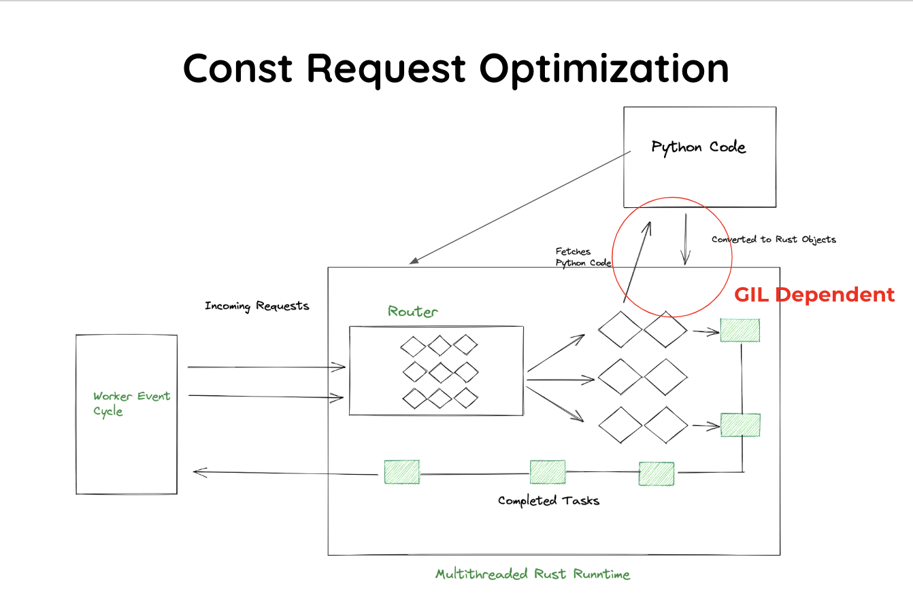

## Architecture Design

Robyn is a Python web server that uses the tokio runtime.

First of all, we have a worker event cycle that basically does all the dirty work. This part manages the runtime and passes all instructions to the rust code.
This spawns the threading pool

Then when we type the command `python3 app.py` the python code is converted to rust objects and then the router is populated. The incoming requests hit the router and then the rust objects are dispatched in the thread pool and executed depending on their types

Now, we can have multiple workers as well as multiple processes in Robyn. This allows the tcp socket to share itself across multiple cores.

## Const Requests

Const Requests is a feature that is unique to Robyn.

What if we could execute the function only once and store the response in the rust response. This would help us save a lot of overhead of calling the router.

This is exactly what const requests tries to achieve.

&nbsp;
&nbsp;
&nbsp;
&nbsp;
&nbsp;
&nbsp;

### Old architecture

